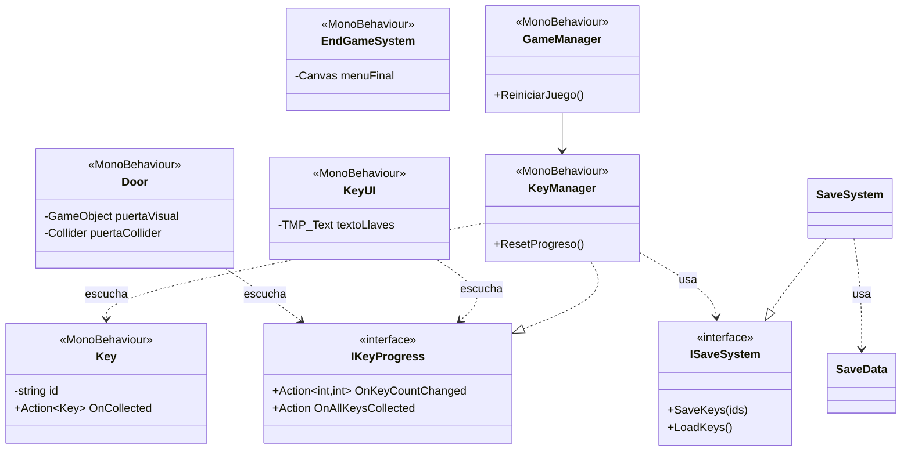

# Ejercicio: sistema de llaves en Unity

Ya tienes casi todo el sistema armado (de nadis). Completa los **tres scripts** para que el juego funcione mejor:

1. `KeyUI`: muestra cuántas llaves llevas (`Llaves: 2/5`).
2. `Door`: la puerta se abre cuando juntas todas las llaves.
3. `EndGameSystem`: al tocar el objeto dorado aparece el menú final y al hacer click en el BTN reiniciar, que se reinicie el game.

Todo lo que necesitas lo puedes ver funcionando en los scripts que ya están hechos.

## Índice uwu

- [Qué ya está hecho y qué te toca](#qué-ya-está-hecho-y-qué-te-toca)
- [Diagrama de Clases](#diagrama-de-clases)
- [Eventos, es importante](#la-idea-clave-eventos)
- [Ejercicio 1: KeyUI](#ejercicio-1-keyui)
- [Ejercicio 2: Door](#ejercicio-2-door)
- [Ejercicio 3: EndGameSystem](#ejercicio-3-endgamesystem)
- [Errores comunes](#errores-comunes)
- [Glosario rápido](#glosario-rápido)
- [Antes de entregar](#antes-de-entregar)

---

## Qué ya está hecho y qué te toca

| Script              | Estado      | Para qué sirve                                            |
| ------------------- | ----------- | --------------------------------------------------------- |
| `IKeyProgress`      | Listo       | Define los dos eventos que avisan del progreso.           |
| `ISaveSystem`       | Listo       | Define cómo se guarda y se carga.                         |
| `SaveSystem`        | Listo       | Guarda los IDs de las llaves como JSON en `PlayerPrefs`.  |
| `Key`               | Listo       | Cada llave tiene un ID único y avisa cuando la recogen.   |
| `KeyManager`        | Listo       | Cuenta las llaves, guarda el progreso y toca los timbres. |
| `GameManager`       | Listo       | Borra la partida y reinicia la escena.                    |
| **`KeyUI`**         | **Te toca** | Mostrar el conteo en pantalla.                            |
| **`Door`**          | **Te toca** | Abrir la puerta al juntar todas las llaves.               |
| **`EndGameSystem`** | **Te toca** | Mostrar el menú final al tocar el objeto dorado.          |

Lo que ya está hecho **no necesitas modificarlo** así que no lo hagas o te bajo puntos unu a menos que lo hagas más chido y demuestres por qué, entonces te subo uno. **Lee los scripts:** por favorsito.

---

## Diagrama de Clases

bueno espero te sirva de algo



Tres cosas para que cheques en el diagrama:

- `KeyUI` y `Door` **no conocen a `KeyManager` como clase**, solo a la interfaz `IKeyProgress`. Esa es la pista de cómo guardar la referencia.
- `EndGameSystem` **no tiene flechas**: no depende de nadie. Se activa solo con su trigger.
- `Key` ya es un buen ejemplo de trigger:**ábrelo antes** de empezar el ejercicio 3.

### Qué pasa cuando juegas

```
Recoges una llave
   -> Key avisa a KeyManager
      -> KeyManager suma, guarda y toca el timbre OnKeyCountChanged
         -> KeyUI actualiza el texto
      -> si ya son todas, toca el timbre OnAllKeysCollected
         -> Door se abre

Tocas el objeto dorado
   -> EndGameSystem muestra el menú final
```

---

## La idea clave: eventos

Un **evento** es como un timbre. `KeyManager` toca el timbre cada vez que algo cambia. Los scripts que quieran enterarse se **suscriben**: "avísame cuando suene". Si ya no les interesa, se **desuscriben**.

Lo importante: quien toca el timbre **no sabe** quién lo escucha. Por eso `KeyManager` no necesita saber que existe una UI ni una puerta.

El patrón siempre es el mismo, en tres pasos:

```csharp
// 1. Awake:     consigues la fuente del evento (de donde viene?? aquí   respondemos eso)
// 2. OnEnable:  te suscribes     ->  fuente.Evento += MiMetodo;
// 3. OnDisable: te desuscribes   ->  fuente.Evento -= MiMetodo;
```

Y una regla de oro: **tu método debe pedir lo mismo que pide el evento**. Si el evento entrega `(int, int)`, tu método recibe `(int, int)`. Si no entrega nada, tu método no recibe nada.

Mira cómo lo hace `KeyManager` con las llaves (`Start`, `OnDisable` y `HandleKeyCollected`). Es exactamente el mismo patrón.

> ¿Por qué desuscribirse? Si el objeto se destruye y sigue suscrito, el evento intentará llamar a algo que ya no existe y obtendrás errores.

---

## Ejercicio 1: KeyUI

**Objetivo:** que el texto en pantalla diga `Llaves: 0/5` al empezar y se actualice cada vez que recoges una llave.

**Qué necesitas saber**

- `KeyManager` implementa `IKeyProgress`, que tiene el evento `OnKeyCountChanged`.
- Ese evento entrega dos números: llaves recolectadas y total.

<details>
<summary>Pista 1: cómo busco el KeyManager</summary>

Unity tiene `FindAnyObjectByType<T>()`. Mira cómo lo hace `Door` en el diagrama: guarda el resultado en una variable de tipo `IKeyProgress`, no `KeyManager`. Piensa por qué.

</details>

<details>
<summary>Pista 2: cómo armo el texto</summary>

Usa interpolación de texto: `$"Llaves: {a}/{b}"`. Y recuerda que un `TMP_Text` tiene la propiedad `.text`.

</details>

<details>
<summary>Pista 3: ¿y si me da NullReferenceException?</summary>

Casi seguro olvidaste arrastrar el texto al campo del Inspector. Revisa también que sea un `TextMeshPro - Text (UI)`.

</details>

**Pregúntate:** ¿por qué al empezar el juego ya aparece `0/5` si todavía no has recogido nada? (Pista: ¿quién llama a `NotificarCambio()` y cuándo se suscribe tu script?)

---

## Ejercicio 2: Door

**Objetivo:** que la puerta desaparezca (y deje de bloquear el paso) cuando juntas todas las llaves.

**Qué necesitas saber**

- El evento que te interesa es `OnAllKeysCollected`.
- Este evento **no entrega datos**, así que tu método no recibe parámetros.
- El patrón es el mismo que en `KeyUI`.

<details>
<summary>Pista 1: qué significa "abrir"</summary>

Son dos cosas distintas: que **no se vea** (el objeto visual) y que **no estorbe** (el collider). Si haces solo una, el jugador verá la puerta abierta pero chocará con algo invisible, o al revés.

</details>

<details>
<summary>Pista 2: cómo apago cada cosa</summary>

Un `GameObject` se apaga con `SetActive(false)`. Un `Collider` se desactiva con su propiedad `enabled`.

</details>

**Pregúntate:** si cierras el juego con 5/5 llaves y lo vuelves a abrir, ¿la puerta empieza abierta o cerrada? ¿Por qué?

---

## Ejercicio 3: EndGameSystem

**Objetivo:** al tocar el objeto dorado, que aparezca el menú final y el juego se detenga.

**Importante:** este script **no escucha ningún evento**. Se pone directamente en el objeto dorado y usa un **trigger**, igual que `Key`. Abre `Key.cs` y fíjate cómo detecta al jugador.

<details>
<summary>Pista 1: mostrar y ocultar el menú</summary>

Un `Canvas` tiene la propiedad `enabled`. Úsala en lugar de `SetActive`. Piensa por qué: si el script estuviera en el mismo objeto del canvas y lo apagaras con `SetActive(false)`, el script dejaría de funcionar.

</details>

<details>
<summary>Pista 2: detener el juego</summary>

`Time.timeScale = 0f` congela todo lo que use el tiempo del juego, incluido el movimiento del player. Con `1f` el tiempo vuelve a la normalidad.

</details>

---

## Errores comunes

| Lo que ves                                  | Qué revisar                                                                                |
| ------------------------------------------- | ------------------------------------------------------------------------------------------ |
| `NullReferenceException` en `KeyUI`         | Falta arrastrar el texto en el Inspector.                                                  |
| El texto no cambia nunca                    | ¿Te suscribiste en `OnEnable`? ¿Tu método tiene la firma `(int, int)`?                     |
| La puerta no se abre                        | ¿Te suscribiste a `OnAllKeysCollected`? ¿Coincide `Total Keys` con las llaves reales?      |
| La puerta se ve abierta pero no puedo pasar | Falta desactivar el collider.                                                              |
| El menú final no aparece                    | ¿El objeto dorado tiene `Is Trigger`? ¿El player tiene tag `Player`? ¿Asignaste el canvas? |
| El menú aparece desde el inicio             | Falta ocultar el canvas en `Awake`.                                                        |
| El juego queda congelado al reiniciar       | Reiniciaste la escena sin devolver `Time.timeScale` a 1. Usa `GameManager`.                |
| Al reiniciar sale el menú final al instante | No se borró el progreso. Usa `ReiniciarJuego()`.                                           |
| Error de compilación con el evento          | Tu método no tiene la misma firma que el evento.                                           |

---

## Glosario rápido

| Palabra                  | Significado sencillo                                                    |
| ------------------------ | ----------------------------------------------------------------------- |
| **Evento**               | Como decir algo, lanzar un grito al aire                                |
| **Suscribirse (`+=`)**   | Alguien a quien le interesa lo que estás diciendo                       |
| **Desuscribirse (`-=`)** | Decir "ya no me interesa lo que dices".                                 |
| **Interfaz**             | Un contrato: lista lo que una clase debe tener, sin decir cómo lo hace. |
| **Trigger**              | Un collider que no bloquea, solo detecta que alguien entró.             |
| **`Time.timeScale`**     | La velocidad del tiempo del juego. En 0 todo se congela.                |
| **JSON**                 | Un formato de texto para guardar datos de forma ordenada.               |
| **`PlayerPrefs`**        | Un espacio que Unity ofrece para guardar datos pequeños.                |
| **`HashSet`**            | Una lista que no permite elementos repetidos.                           |
| **ID**                   | Un nombre único para distinguir una llave de otra.                      |

---

## Antes de entregar

- [ ] Revisa que sí funcione
- [ ] Que no haya errores ni advertencias rojas en la consola.
- [ ] Tus tres scripts se suscriben en `OnEnable` y se desuscriben en `OnDisable` (donde aplica).
- [ ] Puedes explicar con tus palabras por qué `KeyUI` y `Door` usan `IKeyProgress` y no `KeyManager`.(lo tendrás que hacer)
- [ ] Puedes explicar por qué `EndGameSystem` no necesita escuchar eventos. (igual lo tendrás que hacer)

### Retos extra (+1 punto si completas todos)

- Haz que la puerta tenga una animación al abrirse.
- Agrega un sonido al recoger cada llave.
- Muestra un mensaje "Faltan N llaves" cuando el jugador toque la puerta cerrada.
- Muestra en el menú final cuántas llaves recogiste.
